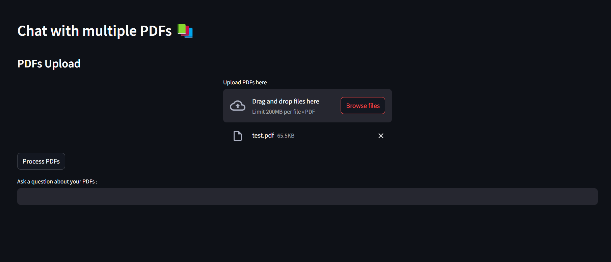
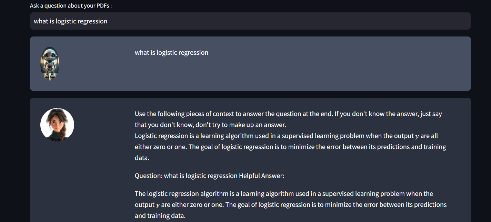

📚 CHAT WITH MULTIPLE PDFs 📚
============================

This project allows users to upload multiple PDF files and chat with their contents using AI-powered text processing and retrieval.

🚀 FEATURES
-----------
✅ Upload multiple PDFs and extract text from them  
✅ Chunk and vectorize text for efficient searching  
✅ Use 🤗 Hugging Face or 🤖 OpenAI models for generating responses  
✅ Interactive chatbot interface using 🎨 Streamlit  

🛠 INSTALLATION
---------------

1️⃣ Clone the Repository:  
   ----------------------
   🖥️ Run the following commands in your terminal:  

   git clone https://github.com/LaababImane/PDFs-chat.git  
   cd PDFs-chat  

2️⃣ Create a Conda Environment:  
   ----------------------------
   🏗️ Set up a Conda virtual environment:  

   conda create --name pdf-chat python=3.9 
   conda activate pdf-chat  

3️⃣ Install Dependencies:  
   ----------------------
   📦 Install the required Python packages:  

   pip install -r requirements.txt  

4️⃣ Set Up Environment Variables:  
   ------------------------------
   🔑 Create a `.env` file in the project root and add your API keys:  

   HUGGINGFACE_API_KEY=your_huggingface_api_key_here  
   OPENAI_API_KEY=your_openai_api_key_here  # If using OpenAI models  

▶️ RUNNING THE APP  
-------------------
🚀 Start the Streamlit app:  

   streamlit run app.py  

⚡ TECHNOLOGIES USED  
---------------------
🔹 Streamlit - For the interactive web UI  
🔹 PyPDF2 - Extract text from PDFs  
🔹 Hugging Face Transformers - AI models for text generation  
🔹 FAISS - Vector search for document retrieval  
🔹 LangChain - Advanced conversational AI  

🎯 FUTURE ENHANCEMENTS  
----------------------
✨ Support for additional document formats (Word, TXT, etc.)  
✨ Improved memory handling for longer conversations  
✨ Deployment on cloud platforms

📸 SCREENSHOTS  
--------------
Here are some screenshots of the application in action:

1️⃣ **Uploading PDFs:**  
     

2️⃣ **Chat Interface:**  
     

📌 To view the screenshots, open the `screens/` folder in this repository.

